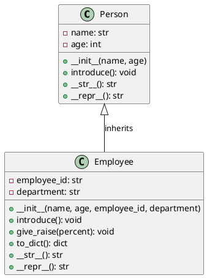

# UML Diagram: Person and Employee Classes

## Class Diagram



## Text Representation

```
┌─────────────────────────────┐
│         Person              │
├─────────────────────────────┤
│ - name: str                 │
│ - age: int                  │
├─────────────────────────────┤
│ + __init__(name, age)       │
│ + introduce(): void         │
│ + __str__(): str            │
│ + __repr__(): str           │
└─────────────────────────────┘
         △
         │
         │ inherits
         │
┌─────────────────────────────┐
│      Employee               │
├─────────────────────────────┤
│ - employee_id: str          │
│ - department: str           │
├─────────────────────────────┤
│ + __init__(name, age,       │
│            employee_id,     │
│            department)      │
│ + introduce(): void         │
│ + give_raise(percent): void │
│ + to_dict(): dict           │
│ + __str__(): str            │
│ + __repr__(): str           │
└─────────────────────────────┘
```

## Relationships

- **Inheritance**: Employee extends Person (is-a relationship)
- **Method Override**: Employee overrides `introduce()`, `__str__()`, and `__repr__()` from Person
- **Additional attributes**: Employee adds `employee_id` and `department`
- **Additional methods**: Employee adds `give_raise()` and `to_dict()`

## Class Details

### Person (Base Class)
- **Attributes**:
  - `name` (str): Person's name
  - `age` (int): Person's age
- **Methods**:
  - `__init__(name, age)`: Constructor with age validation
  - `introduce()`: Print introduction message
  - `__str__()`: User-friendly string representation
  - `__repr__()`: Developer-friendly debug representation

### Employee (Derived Class)
- **Inherits from**: Person
- **Additional Attributes**:
  - `employee_id` (str): Unique employee identifier
  - `department` (str): Department name
- **Methods**:
  - `__init__(name, age, employee_id, department)`: Constructor calling parent constructor
  - `introduce()`: Override to include employee details
  - `give_raise(percent)`: Display raise information
  - `to_dict()`: Convert employee data to dictionary
  - `__str__()`: Override user-friendly representation
  - `__repr__()`: Override debug representation
