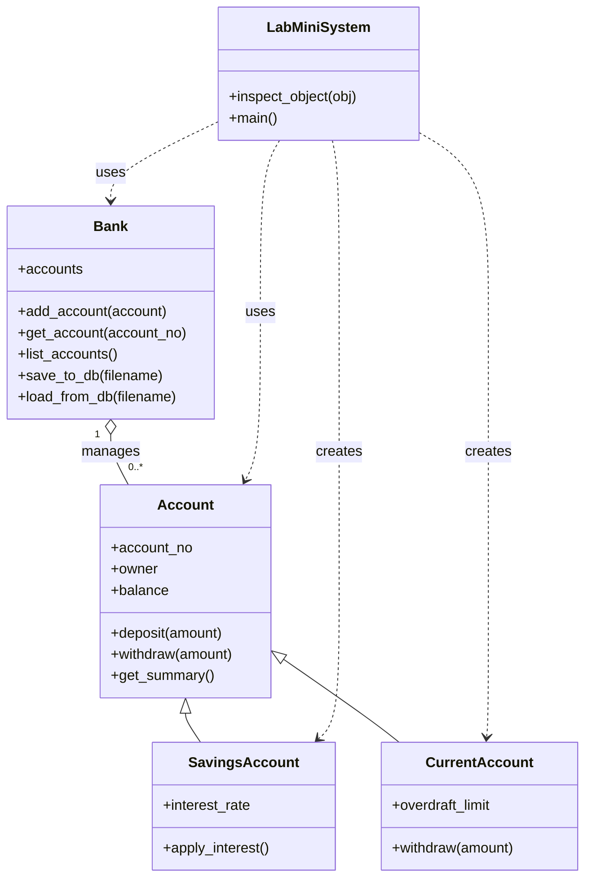

```mermaid
classDiagram
    class Account {
        +account_no
        +owner
        +balance
        +deposit(amount)
        +withdraw(amount)
        +get_summary()
    }

    class SavingsAccount {
        +interest_rate
        +apply_interest()
    }

    class CurrentAccount {
        +overdraft_limit
        +withdraw(amount)
    }

    class Bank {
        +accounts
        +add_account(account)
        +get_account(account_no)
        +list_accounts()
        +save_to_db(filename)
        +load_from_db(filename)
    }

    class LabMiniSystem {
        +inspect_object(obj)
        +main()
    }

    Account <|-- SavingsAccount
    Account <|-- CurrentAccount
    Bank "1" o-- "0..*" Account : manages
    LabMiniSystem ..> Bank : uses
    LabMiniSystem ..> Account : uses
    LabMiniSystem ..> SavingsAccount : creates
    LabMiniSystem ..> CurrentAccount : creates
```